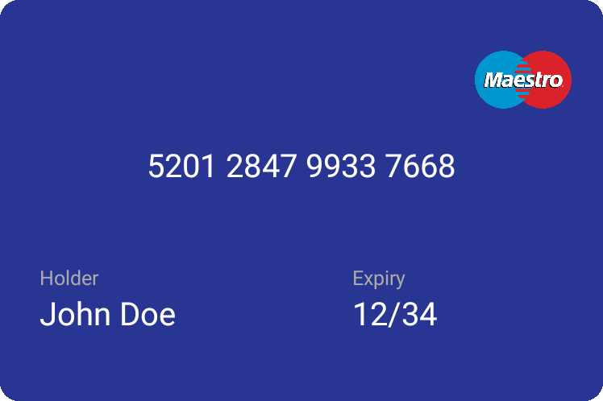
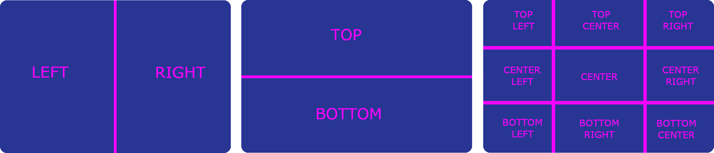
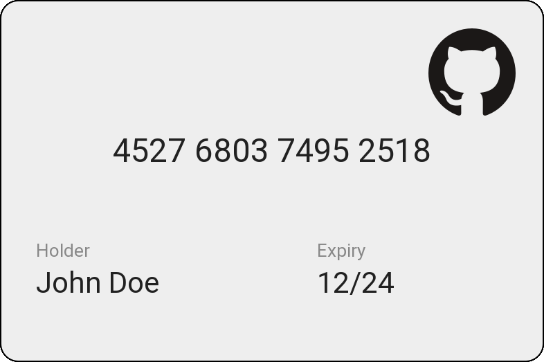
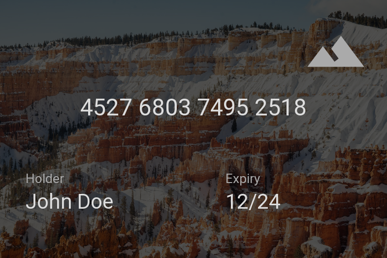
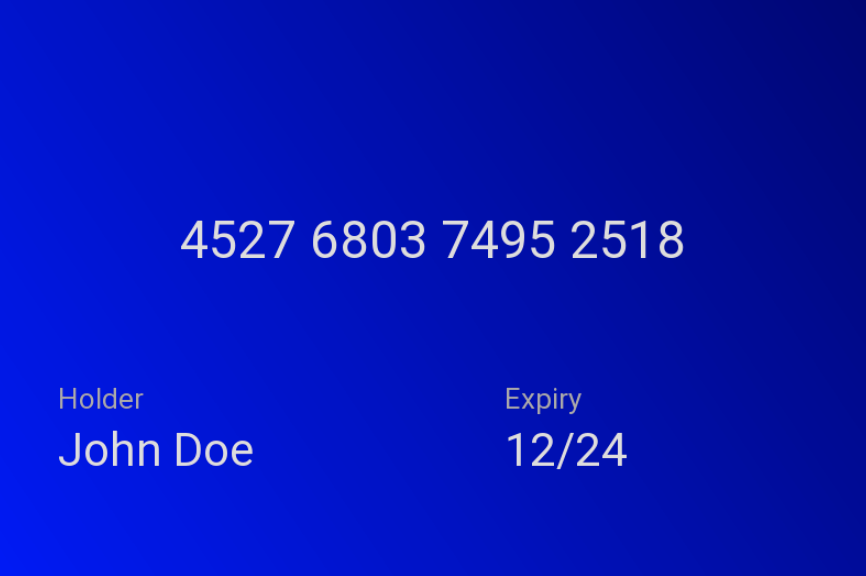

# CreditCardView
A fully customisable Android view that displays credit card's information

#### Index
+ [Getting started](#getting-started)
+ [Basic usage](#basic-usage)
+ [Grid and Area click](#grid-and-area-click)
+ [Number formats](#number-formats)
+ [Number fillers](#number-fillers)
+ [Input pairing](#input-pairing)
+ [Flipping](#flipping)
+ [Customization](#Customizations)
+ [Expiry parsing](#expiry-parsing)
+ [Examples](#examples)

## Getting started
In your project's build.gradle

```gradle
repositories {
	maven { url "https://jitpack.io" }
}
```

In your modules's build.gradle

```gradle
dependencies {
    implementation 'com.github.maxpilotto:credit-card-view:$latest_version'
    implementation 'androidx.constraintlayout:constraintlayout:+'
}
```

## Basic usage
```xml
<com.maxpilotto.creditcardview.CreditCardView
    android:id="@+id/card"
    android:layout_width="300dp"
    android:layout_height="200dp"

    app:cvv="123"
    app:expiry="1234"
    app:holder="John Doe"
    app:number="5201284799337668"
    app:holderLabel="Holder"
    app:expiryLabel="Expiry"/>
```


## Grid and Area click
You can set up a click listener for specific areas in the card, these can be either fixed areas or custom areas, defined through a grid

#### Area
There are 13 defined areas, you can listen for an Area Click event by using the `setAreaClickListener()` method
```kotlin
card.setAreaClickListener { card, area ->
    if (area == CardArea.LEFT) {
        // Left area clicked
    } else if (area == CardArea.RIGHT) {
        // Right area clicked
    }
}
```
The callback will give you the `CreditCardView` on which the listener was set and the area clicked, the callback might be invoked multiple times for one single click, since some areas overlap
 


#### Grid
If you need more areas you can create your own touch grid, by using the `setGridClickListener` method
```kotlin
card.setGridClickListener(10, 5) { card, point ->
    // Get the x and y from point 
    // to see which cell was clicked
}
``` 
The callback will give you the `CreditCardView` and the `Point` representing the cell that was clicked, in a 10x5 grid there's 50 cells that can be clicked

## Number formats
The card number can be formatted automatically by setting the value of `numberFormat`, this uses the `NumberFormat` utility  

The format is used only on the shown value, the actual value is kept unformatted

The following parameters can be used
+ `%d` , placeholder for a single or multiple digits, this can be followed by a numberthat indicates how many digits should be placed there

+ `%s` , placeholder for a group of 1 digit, a number can be added to specify how big each group is,the number of groups is variable and their size is specified by the number parameter (the size is not uaranteed)

+ `%r` , placeholder for the remaining characters, this will be replaced by the remaining characters that
  were not used by the other placeholders

+ `%c` , moves the cursor ahead, this is generally used to skip characters, it also accepts a number parameter
  that tells the format how many characters should be skipped
 
## Number fillers
Fillers are used to fill in a field when some characters are missing, both the cvv and the number support fillers

Fillers are composed by a `length` and a `fillValue`, when the input's `length` is smaller than the filler's `length` than the remaining size will be filled with the `fillValue`

If your filler's length is 10, the fill value is `*` and your input is `"1234"` you will get `"1234******"`

Multiple fillers can be used at the same time, they are applied based on their length, from the shortest to the longest

Fillers can also be loaded from an XML file, they must have the following syntax 
```xml
<Fillers>
    <Filler
        length="16"
        fillValue="*" />
    <Filler
        length="19"
        fillValue="*" />
    <Filler
        length="0"
        fillValue="*" />
</Fillers>
```

## Input pairing
You can pair different TextViews to the card's fields, in this way you don't need to edit the card data by yourself, it can be done like this:

```kotlin
// Kotlin
card.apply {
    pairInput(CardInput.HOLDER, holderTv)
    pairInput(CardInput.NUMBER, numberTv)
    pairInput(CardInput.EXPIRY, expiryTv)
    pairInput(CardInput.CVV, cvvTv)
}
```

or 

```java
// Java
card.pairInput(CardInput.HOLDER, holderTv)
card.pairInput(CardInput.NUMBER, numberTv)
card.pairInput(CardInput.EXPIRY, expiryTv)
card.pairInput(CardInput.CVV, cvvTv)
```

## Flipping
The card can be flipped in two different ways:
+ onClick, when a click occurs
+ onDataEdit, when any of the fields is edited

Both can be disabled and the animation can be customized by changing respectively `flipOnClickAnimation` and `flipOnEditAnimation`

You can create a custom animation by creating a class that extends the `Animation` class

## Customizations
This view supports multiple styles, one for each brand, that can be set either from the layout

```xml
app:amexStyle="@style/DefaultAmex"
app:dinersStyle="@style/DefaultDiners"
app:discoverStyle="@style/DefaultDiscover"
app:genericStyle="@style/DefaultGeneric"
app:jcbStyle="@style/DefaultJcb"
app:maestroStyle="@style/DefaultMaestro"
app:mastercardStyle="@style/DefaultMastercard"
app:unionpayStyle="@style/DefaultUnionpay"
app:visaStyle="@style/DefaultVisa"
```
or programmatically
```java
card.setStyle(Brand.VISA,R.style.CustomVisa)
```

Everytime the brand changes, the new style is loaded and all the attributes are loaded

There is, anyway, an exception for the `number`, `cvv`, `expiry` and `holder` which are loaded the first time only (from the view's attributes) and can be changed programmatically later

## Expiry parsing
The expiry can be parsed from different formats into a standard format (mmYY), this can be done using the `Expiry` utility

The supported format/objects are:
+ Calendar
+ Date (java.util)
+ Date, with specified DateFormat
+ String
    + null
    + empty
    + 09/18
    + 0918
    + 09-18
    + 09/2018
    + 092018
    + 09-2018
    + 2018/09
    + 2018-09

## Examples






*Ocean by [Matt Hardy](https://www.pexels.com/@matthardy)*  
*Bryce Canyon by [Kelsey Johnson](https://www.pexels.com/@kelsey-johnson-1226441)*

## License
```
Copyright 2018 Max Pilotto

Licensed under the Apache License, Version 2.0 (the "License");
you may not use this file except in compliance with the License.
You may obtain a copy of the License at

        http://www.apache.org/licenses/LICENSE-2.0

Unless required by applicable law or agreed to in writing, software
distributed under the License is distributed on an "AS IS" BASIS,
WITHOUT WARRANTIES OR CONDITIONS OF ANY KIND, either express or implied.
See the License for the specific language governing permissions and
limitations under the License.
```